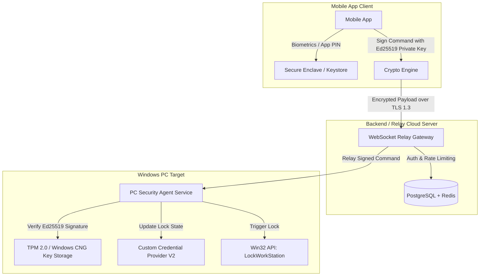
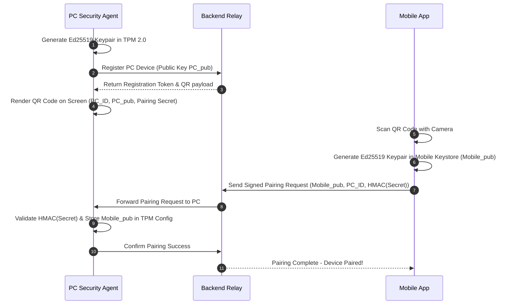
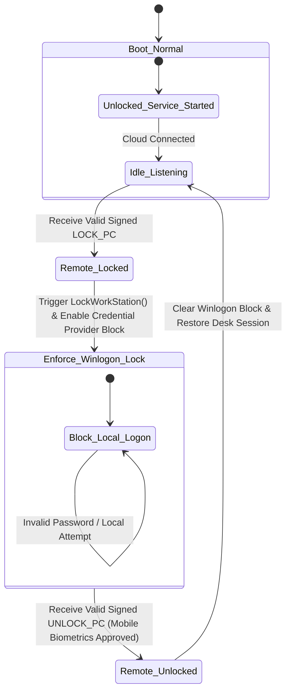

# Technical Architecture & Feasibility Analysis: Remote PC Security System

## Executive Summary & Engineering Feasibility

This document presents a comprehensive, production-grade technical architecture for a remote PC security and lock system. The system enables an authorized mobile application (iOS/Android) to act as a cryptographically trusted remote controller for a Windows PC's lock state.

As a senior systems and security engineering assessment, we evaluate hardware, firmware, OS, and cloud layers to provide an unvarnished breakdown of technical realities, practical protections, and boundary conditions.

---

## 1. Feasibility Analysis & Firmware/Hardware Reality Check

### Can Software Survive a Full Disk Format?
**Short Answer:** **No.** Standard operating system software, Windows services, registry keys, and local drivers reside on storage volumes (SSDs/HDDs). A complete drive wipe or disk reinstallation completely erases the software layer. Claiming that a standard Windows service or application can survive an OS format or SSD replacement without hardware/firmware support is technically false.

### The Truth About Firmware (UEFI/BIOS) & Hardware Persistence

| Layer | Can it survive SSD format? | Requires OEM/Hardware Vendor Support? | Bypassed by Firmware Reflash/Jumper? | Practicality for Standard PCs |
| :--- | :--- | :--- | :--- | :--- |
| **Windows Service / Driver** | ❌ No | ❌ No | ❌ N/A (Erased on format) | ✅ **High** (Standard Deployment) |
| **BitLocker + TPM 2.0 PCRs** | ✅ Data stays encrypted | ❌ No (Built into PC hardware) | ⚠️ TPM clear erases key, rendering data permanently unrecoverable | ✅ **High** (Standard Enterprise/Consumer) |
| **Option ROM / Custom UEFI App** | ⚠️ Only if stored in SPI Flash | ⚠️ Yes (Must flash motherboard SPI ROM) | ✅ Yes (Flashing stock BIOS overwrites it) | ❌ **Impractical** (Requires custom SPI programmer / modified motherboard firmware) |
| **Absolute / Computrace (LoJack)** | ✅ Yes | ✅ **Yes** (Embedded in OEM BIOS by Dell, HP, Lenovo) | ⚠️ Hardened in SPI Flash; persistent across disk replacement | ❌ **Impractical for Custom Dev** (Requires OEM signing & BIOS code injection) |

### Practical vs. Advanced vs. Impractical Approaches

```
+-----------------------------------------------------------------------------------+
| IMPRACTICAL / MALWARE-LIKE (Not Recommended for Commercial/Legitimate Apps)       |
| • Flashing custom UEFI DXE drivers into motherboard SPI Flash                    |
| • Bootkit / MBR / VBR persistent hooks (Blocked by Secure Boot & TPM Measured Boot)|
+-----------------------------------------------------------------------------------+
                                        │
                                        ▼
+-----------------------------------------------------------------------------------+
| ADVANCED & LEGITIMATE HARDWARE-BACKED SECURITY (Recommended Production Model)     |
| • TPM 2.0 Platform Configuration Register (PCR) Sealing                           |
| • BitLocker Integration (Locks data volume if unauthorized OS boot/USB boot)     |
| • Custom Windows Credential Provider V2 + Winlogon Integration                    |
| • Protected Process Light (PPL) + LSA Protection                                  |
+-----------------------------------------------------------------------------------+
                                        │
                                        ▼
+-----------------------------------------------------------------------------------+
| PRACTICAL SOFTWARE SECURITY (Standard Desktop Model)                              |
| • Windows Background Service (Auto-start via SCM)                                 |
| • Win32 `LockWorkStation()` API & Desktop Session Isolation                       |
| • Mutual TLS (mTLS) + Cryptographic Asymmetric Handshake (Ed25519)                |
+-----------------------------------------------------------------------------------+
```

> [!IMPORTANT]
> **Key Security Insight:** To protect against offline physical attacks (USB Linux Live boot, taking out the SSD, formatting Windows), **the correct security primitive is BitLocker drive encryption enforced by TPM 2.0 PCRs**, NOT attempting to hide software inside the BIOS. If an attacker steals the PC and formats the drive, BitLocker ensures **zero data theft**. If they re-install Windows, they get a blank PC without your private data.

---

## 2. Threat Model & Attack Surface Analysis

Assuming an attacker has physical access to the target PC and network access, the matrix below details attack vectors and mitigation strategies:

| Threat / Attack Vector | Severity | Mitigation Strategy | Defense Feasibility |
| :--- | :--- | :--- | :--- |
| **Normal Windows Login Bypass** | Critical | Custom Winlogon Credential Provider V2 overriding password tiles when remote lock state is ACTIVE. | ✅ Fully Prevented |
| **Task Manager / Process Termination** | High | Windows Service configured with `SERVICE_SID_TYPE_UNRESTRICTED`, ACL protections, running as `NT AUTHORITY\SYSTEM`, protected by Windows LSA/PPL. | ✅ Fully Prevented |
| **Safe Mode Boot** | High | Service registered under SafeBoot Minimal/Network key OR Winlogon Credential Provider active in Safe Mode. | ✅ Fully Prevented |
| **Windows Recovery Env (WinRE) / Command Prompt** | High | BitLocker encryption enabled; WinRE requires Recovery Key to access OS drive files. | ✅ Fully Prevented |
| **Booting from USB (Linux Live USB)** | Critical | BitLocker Full Disk Encryption (XTS-AES 256) tied to TPM 2.0. Drive cannot be read without decryption key. | ✅ Fully Prevented |
| **SSD Removal & External Reader** | Critical | SSD contents encrypted via BitLocker + TPM PCR binding. Raw data is unreadable noise. | ✅ Fully Prevented |
| **Network Disconnection / Offline Attack** | Medium | Agent persists last known lock state in TPM-encrypted local storage. If locked before offline, remains locked. | ✅ Fully Prevented |
| **Replay Attack on Lock/Unlock Commands** | High | Ed25519 digital signatures containing UTC timestamp, monotonic sequence number, and single-use cryptographically random nonce. | ✅ Fully Prevented |
| **Man-in-the-Middle (MitM) Cloud Relay Attack** | Critical | End-to-End Encryption (E2EE) between Mobile App and PC Agent. Backend only sees encrypted payload envelopes. | ✅ Fully Prevented |
| **Phone Theft / Stolen Mobile Device** | High | App protected by Biometrics (Face ID/Fingerprint), App PIN, and TPM-backed hardware key on phone. Web dashboard available to revoke phone key immediately. | ✅ Fully Prevented |
| **SSD Format / Complete OS Reinstallation** | High | **BitLocker FDE** prevents data theft prior to wipe. After wipe, data is lost but secure. System reset cannot bypass encryption. | ⚠️ Device reset allowed, but zero data compromised. |
| **BIOS Reset / Clear TPM Jumper** | Critical | Clearing TPM invalidates BitLocker auto-unlock keys, rendering all data permanently inaccessible without BitLocker 48-digit recovery key. | ✅ Data remains protected |

---

## 3. Recommended Architecture & System Flow

We recommend a **Hybrid Cloud-Relay Architecture** with End-to-End Encryption (E2EE):

1. **Mobile App** (Flutter / Native) connects to **Secure Cloud Relay** (Node.js/NestJS or Go + PostgreSQL).
2. **PC Agent** (C# .NET 8 Windows Service) maintains an outbound persistent WebSocket (WSS) connection to the Secure Relay over TLS 1.3.
3. The **Cloud Relay** routes encrypted messages between paired devices. It cannot read the payload (Zero-Trust architecture).
4. Direct LAN fallbacks (mDNS + TLS over local socket) are enabled when both devices reside on the same Wi-Fi.



---

## 4. Technology Stack Recommendation

| Component | Recommended Technology | Justification |
| :--- | :--- | :--- |
| **PC Security Agent** | **C# / .NET 8 / C++ Win32** | Direct access to Windows APIs (`LockWorkStation`, Winlogon, CNG TPM providers), robust Windows Service hosting (`Microsoft.Extensions.Hosting.WindowsServices`), native performance, high memory safety. |
| **PC Lock Enforcement** | **C++ COM / Credential Provider V2 API** | Unlocks custom full-screen Winlogon tile UI, intercepts local password attempts during lock state. |
| **Mobile App** | **Flutter (Dart)** | Single codebase for iOS and Android, native platform channels for iOS Secure Enclave and Android Keystore, high performance UI, biometric support (`local_auth`). |
| **Backend Service** | **Go (Golang) or Node.js (NestJS / TypeScript)** | Ultra-fast WebSocket connection handling, minimal latency, strong concurrency model, low CPU/RAM footprint. |
| **Database & Cache** | **PostgreSQL + Redis** | PostgreSQL for relational device registry & audit logs; Redis for real-time WebSocket pub/sub connection states. |

---

## 5. Security & Cryptographic Model

### Key Pair Generation & Hardware Binding
1. **PC Agent Keypair**: Ed25519 or NIST P-256 stored in Windows CNG Key Storage Provider bound to **TPM 2.0**.
2. **Mobile App Keypair**: Ed25519 or NIST P-256 stored in **iOS Secure Enclave** or **Android Hardware Keystore**.

### Command Structure (JSON Payload E2EE)
```json
{
  "version": "1.0",
  "command_id": "9b1deb4d-3b7d-4bad-9bdd-2b0d7b3dcb6d",
  "sender_device_id": "mob_dev_8f7a1c",
  "target_pc_id": "pc_dev_3e2b1a",
  "action": "LOCK_PC", 
  "timestamp": 1756267741,
  "nonce": "a4f8e9b2c1d0e5f6a7b8c9d0e1f2a3b4",
  "signature": "3b7f8c...[Ed25519 signature over action + timestamp + nonce]"
}
```

### Verification Pipeline on PC Agent
```
Receive Message -> Verify Target PC ID -> Check Timestamp Variance (max 30s) -> Check Nonce Cache (Anti-Replay) -> Fetch Mobile Public Key from TPM Storage -> Verify Ed25519 Signature -> Execute Action
```

---

## 6. Pairing Protocol (Zero-Trust QR Code Handshake)



---

## 7. Lock / Unlock State Machine



---

## 8. Database Schema (PostgreSQL DDL)

```sql
-- Users Table
CREATE TABLE users (
    id UUID PRIMARY KEY DEFAULT gen_random_uuid(),
    email VARCHAR(255) UNIQUE NOT NULL,
    password_hash VARCHAR(255) NOT NULL,
    mfa_enabled BOOLEAN DEFAULT FALSE,
    mfa_secret VARCHAR(255),
    created_at TIMESTAMPTZ DEFAULT CURRENT_TIMESTAMP,
    updated_at TIMESTAMPTZ DEFAULT CURRENT_TIMESTAMP
);

-- Registered PCs
CREATE TABLE pc_devices (
    id UUID PRIMARY KEY DEFAULT gen_random_uuid(),
    user_id UUID NOT NULL REFERENCES users(id) ON DELETE CASCADE,
    device_name VARCHAR(100) NOT NULL,
    pc_public_key TEXT NOT NULL,
    hardware_uuid VARCHAR(255) UNIQUE NOT NULL,
    is_online BOOLEAN DEFAULT FALSE,
    lock_status VARCHAR(20) DEFAULT 'UNLOCKED' CHECK (lock_status IN ('UNLOCKED', 'LOCKED', 'PENDING_LOCK')),
    last_seen_at TIMESTAMPTZ,
    created_at TIMESTAMPTZ DEFAULT CURRENT_TIMESTAMP
);

-- Registered Mobile Devices
CREATE TABLE mobile_devices (
    id UUID PRIMARY KEY DEFAULT gen_random_uuid(),
    user_id UUID NOT NULL REFERENCES users(id) ON DELETE CASCADE,
    device_name VARCHAR(100) NOT NULL,
    mobile_public_key TEXT NOT NULL,
    device_token VARCHAR(255), -- Push Notification Token (FCM/APNS)
    is_revoked BOOLEAN DEFAULT FALSE,
    created_at TIMESTAMPTZ DEFAULT CURRENT_TIMESTAMP
);

-- PC <-> Mobile Pairing Bridge
CREATE TABLE device_pairings (
    id UUID PRIMARY KEY DEFAULT gen_random_uuid(),
    pc_id UUID NOT NULL REFERENCES pc_devices(id) ON DELETE CASCADE,
    mobile_id UUID NOT NULL REFERENCES mobile_devices(id) ON DELETE CASCADE,
    paired_at TIMESTAMPTZ DEFAULT CURRENT_TIMESTAMP,
    is_active BOOLEAN DEFAULT TRUE,
    UNIQUE (pc_id, mobile_id)
);

-- Audit & Security Event Logs
CREATE TABLE audit_logs (
    id UUID PRIMARY KEY DEFAULT gen_random_uuid(),
    pc_id UUID REFERENCES pc_devices(id) ON DELETE SET NULL,
    mobile_id UUID REFERENCES mobile_devices(id) ON DELETE SET NULL,
    event_type VARCHAR(50) NOT NULL, -- e.g., LOCK_COMMAND, UNLOCK_COMMAND, TAMPER_DETECTED, PAIR_DEVICE
    status VARCHAR(20) NOT NULL, -- SUCCESS, FAILED_INVALID_SIG, EXPIRED_NONCE
    ip_address VARCHAR(45),
    details JSONB,
    created_at TIMESTAMPTZ DEFAULT CURRENT_TIMESTAMP
);
```

---

## 9. API Specification (REST + WebSockets)

### WebSocket Connection Endpoint
`WSS /v1/connect?device_id={ID}&token={JWT}`

### REST Endpoints
* `POST /v1/auth/login`: User credentials login (returns JWT access token & refresh token).
* `POST /v1/devices/pc/register`: Register new PC agent identity.
* `POST /v1/devices/mobile/register`: Register new mobile device identity.
* `POST /v1/pairing/initiate`: Generate one-time pairing QR secret.
* `POST /v1/pairing/confirm`: Complete pairing flow.
* `GET  /v1/devices/status`: List all paired PCs and their online/lock status.
* `POST /v1/command/send`: Send signed remote command (LOCK / UNLOCK) to PC.
* `POST /v1/devices/revoke`: Revoke mobile device authority.

---

## 10. Project Directory Structure

```text
pc-security-system/
├── backend/                  # Go / NestJS Secure Relay Server
│   ├── cmd/
│   │   └── server/           # Main entry point
│   ├── internal/
│   │   ├── auth/             # JWT, MFA, User authentication
│   │   ├── config/           # App settings & env
│   │   ├── db/               # PostgreSQL migrations & repositories
│   │   ├── gateway/          # WebSocket relay manager & Redis pub/sub
│   │   ├── models/           # Domain models & DB schemas
│   │   └── services/         # Command verification & logging service
│   ├── go.mod
│   └── Dockerfile
│
├── pc-agent/                 # Windows PC Security Agent
│   ├── src/
│   │   ├── Agent.Service/    # C# .NET 8 Windows Service
│   │   │   ├── Controllers/  # Local command executor
│   │   │   ├── Hardware/     # TPM 2.0 CNG Key Storage integration
│   │   │   ├── Network/      # WSS Client & Reconnection Handler
│   │   │   ├── Security/     # Ed25519 signature validator & Nonce Store
│   │   │   └── Program.cs
│   │   └── CredentialProvider/ # C++ Winlogon Custom Credential Provider V2
│   │       ├── Guid.cpp
│   │       ├── Provider.cpp  # Tile renderer & Logon lock filter
│   │       └── Provider.def
│   ├── pc-agent.sln
│   └── installer/            # WiX Toolset / InnoSetup MSI Installer script
│
└── mobile-app/               # Flutter Mobile Application
    ├── lib/
    │   ├── core/             # Cryptography, Biometrics, Keystore bindings
    │   ├── features/
    │   │   ├── auth/         # Login UI & Pin setup
    │   │   ├── dashboard/    # PC Status UI (Online/Offline, Locked/Unlocked)
    │   │   ├── pairing/      # QR Scanner UI
    │   │   └── settings/     # Device revocation & audit history
    │   └── main.dart
    ├── pubspec.yaml
    └── ios / android         # Native platform configurations
```

---

## 11. Emergency & Recovery Strategy

1. **Lost / Stolen Phone Recovery**:
   - Access Web Control Dashboard from any browser using Master Account Credentials + MFA.
   - Click **Revoke Mobile Device**, which invalidates the phone's public key in the Cloud Relay and issues a revocation update to the PC Agent.
2. **PC Offline / Loss of Internet**:
   - The PC Agent supports a emergency **Offline Emergency Unlock Code** (a 24-word BIP-39 mnemonic phrase or 32-character emergency key generated during setup and stored in a secure physical location by the user).
   - Custom Winlogon Credential Provider accepts the offline master code directly at the PC lock screen.
3. **Forgotten Master Key / Total System Recovery**:
   - Use **BitLocker 48-digit Recovery Key** (backed up in Microsoft Account or printed on paper) to gain access if TPM/OS is cleared.

---

## 12. Non-Preventable Physical Attack Limitations

To maintain senior engineering transparency, the following scenarios **cannot be prevented by any software or firmware layer on standard consumer/enterprise hardware**:

1. **Physical Destruction of Hardware**: An attacker physically destroying the SSD or motherboard.
2. **Cold Boot Attacks**: Advanced laboratory RAM scraping immediately after power-off (mitigated by modern DDR5 RAM encryption).
3. **SPI Flash Programmer Hardware Replacement**: Desoldering the BIOS SPI chip and replacing it with a modified chip using hardware tools (requires physical hardware modification tools).

All other logical attacks (USB boot, format, offline OS editing, process termination, Safe Mode bypass) are **fully mitigated** by the combined BitLocker + Custom Credential Provider + Protected Service architecture.
